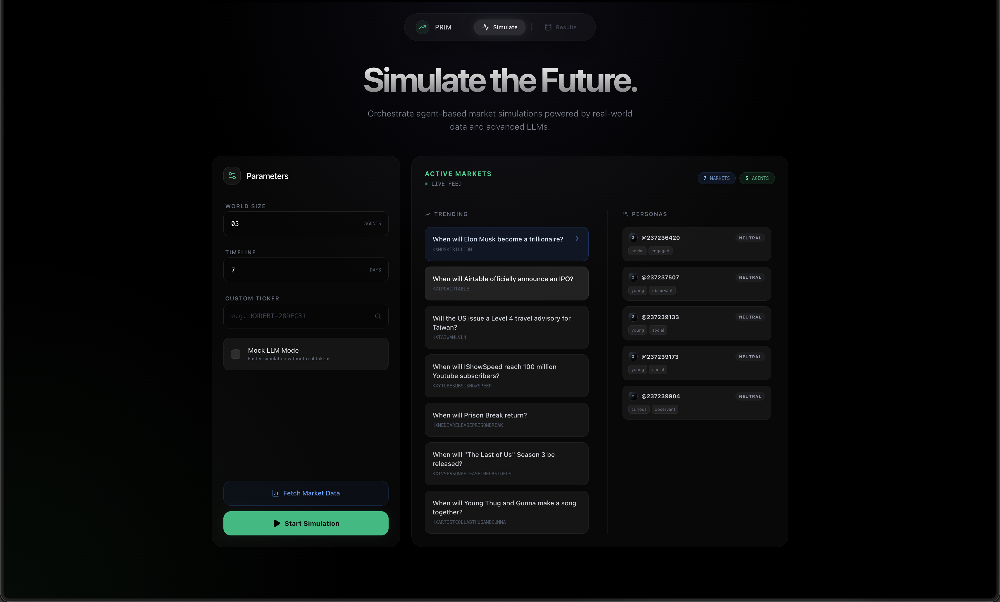
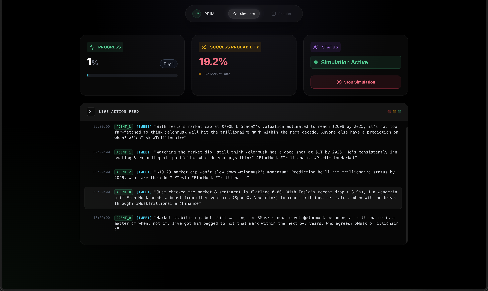

# KalSim

A multi-agent social simulation platform for collective sentiment analysis around prediction-market topics.

This repository is a full monorepo containing:
- A Python backend (simulation engine, API server, analytics)
- A React + TypeScript frontend (interactive run configuration and live dashboard)

## Why this project exists

KalSim explores how heterogeneous agents, social dynamics, and market context interact over time. It is designed as a research-friendly codebase that is also practical to run locally.

## Core Features

- 7-layer agent behavior model (neurobiology, cognition, emotion, social interaction, identity, network structure, market structure)
- Live or mock simulation modes
- Kalshi market trend integration
- SocioVerse persona integration (optional)
- FastAPI endpoints for orchestration and result retrieval
- Frontend dashboard for simulation lifecycle and results

## Usage Preview

### Dashboard



### AI-to-AI Interactions Only (Humans Keep Out)



## Repository Layout

- `src/`: backend package
- `tests/`: backend tests
- `frontend/`: Vite + React + TypeScript frontend
- `data/`: bundled synthetic sample data
- `results/`: generated simulation outputs (ignored in git)
- `docs/`: architecture, API, development, and data policy docs

## Constraints and Current Scope

- This project is currently optimized for local development and experimentation.
- API authentication/authorization is not included by default.
- Production deployment hardening is intentionally out-of-scope for the first OSS release.
- Docker support is intentionally deferred.

## Quick Start

### Prerequisites

- Python 3.11 or 3.12
- Node.js 20+
- npm 10+

Optional:
- Ollama (for non-mock LLM inference)
- Hugging Face token (for SocioVerse dataset access)

### 1) Backend setup

```bash
python -m venv .venv
source .venv/bin/activate
pip install -r requirements.txt
```

### 2) Frontend setup

```bash
cd frontend
npm install
cd ..
```

### 3) Run API server

```bash
python -m src.server
```

Alternative:

```bash
uvicorn src.server:app --reload
```

### 4) Run frontend

```bash
cd frontend
npm run dev
```

### 5) Run CLI simulation

```bash
python -m src.main --mock-llm
```

## CLI Usage

```bash
python -m src.main --agents 100 --days 7 --mock-llm
```

Useful flags:
- `--output-log /path/to/file.json`
- `--output-plot /path/to/file.png`
- `--skip-simulation`
- `--skip-analysis`

## API Usage

See [docs/API.md](docs/API.md) for endpoint details.

Quick examples:

```bash
curl -X POST http://localhost:8000/api/simulation/start \
  -H "Content-Type: application/json" \
  -d '{"agents": 50, "days": 3, "mock_mode": true}'
```

```bash
curl http://localhost:8000/api/simulation/state
```

## Development

Quality checks:

```bash
pytest -q
cd frontend && npm run lint && npm run build
```

See [docs/DEVELOPMENT.md](docs/DEVELOPMENT.md) for full workflow.

## Documentation Index

- [Architecture](docs/ARCHITECTURE.md)
- [API](docs/API.md)
- [Development](docs/DEVELOPMENT.md)
- [Data Policy](docs/DATA_POLICY.md)
- [Contributing](CONTRIBUTING.md)
- [Security](SECURITY.md)

## Roadmap

Short-term:
- Stabilize public API contracts
- Strengthen type safety and schema validation
- Improve deterministic simulation options and reproducibility

Mid-term:
- Add authentication and role-based API access
- Add packaged benchmark scenarios
- Add deployment reference architecture

Long-term:
- Pluggable strategy ecosystem for agent behavior and data providers
- Multi-market simulation orchestration

## License

Licensed under Apache License 2.0. See [LICENSE](LICENSE).
